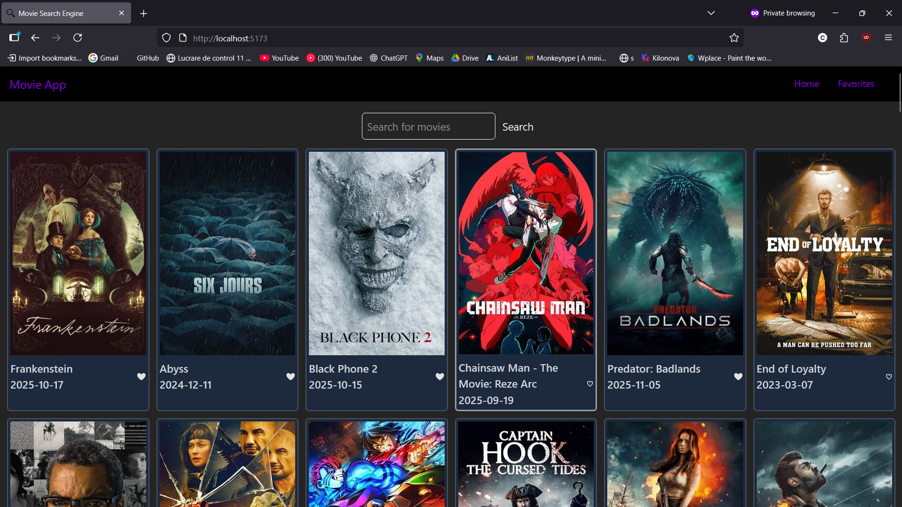
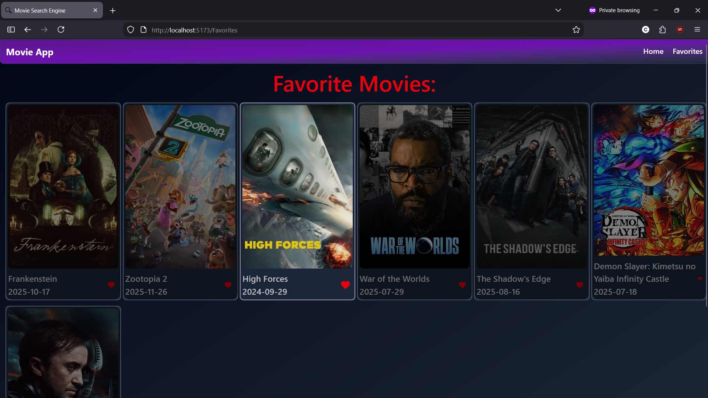

<div align="center">
    <h1 align="center">Movie Search Engine</h1>
    <p align="center">
    A <b>Movie Search Engine</b> used to easily search your <b>favorite movies</b>, manage your account, and save your favorites to a personal library.
    <br/>
    <a href="https://github.com/constantyn-silvian/Movie-Search-Engine/issues/new?labels=bug&template=bug_report.md">Report Bug</a>
    &middot;
    <a href="https://github.com/constantyn-silvian/Movie-Search-Engine/issues/new?labels=enhancement&template=feature_report.md">Request Feature</a>
    &middot;
    <a href="https://github.com/constantyn-silvian/Movie-Search-Engine/blob/main/CHANGELOG.md">Changelog</a>
    </p>
</div>

# About The Project

A search engine for finding various types of movies from the TMDb database. The home page displays the current most popular movies so you can start planning to watch new films with ease.

Users can create an account, log in, and save movies to a personal favorites page. All user data and favorites are persisted in a **PostgreSQL** database.

## Features

- 🎬 **Movie Search** — Search movies from the TMDb database by title
- 🔥 **Popular Movies** — Home page shows current trending/popular movies
- ❤️ **Favorites** — Save and manage your personal favorites list (requires login)
- 🔐 **Authentication** — Register and log in with a secure JWT-based account system
- 🗄️ **PostgreSQL** — All users and favorites are persisted in a PostgreSQL database

## Demo

#### Home Page


---

#### Favorites Page


## Installing and Setup

### Prerequisites

- Node.js & NPM
- PostgreSQL (running locally)

### Install dependencies

```sh
npm install
```

### Setup API key

https://developer.themoviedb.org/docs/getting-started

Follow the guide from the link above: create an account, log in and get your API key, then put the key in `backend/movies.js`.

### Setup PostgreSQL

Open **SQL Shell (psql)** as `postgres` and run the following commands:

```sql
CREATE DATABASE "movie-engine_db";
CREATE USER "movie-engine" WITH PASSWORD 'password';
GRANT ALL PRIVILEGES ON DATABASE "movie-engine_db" TO "movie-engine";
\c "movie-engine_db"
GRANT ALL ON SCHEMA public TO "movie-engine";
```

This only needs to be done once. The tables (`users`, `movies`) are created automatically when the backend starts.

### Setup environment variables

Create a `backend/.env` file and add your JWT secret:

```env
API_KEY = "Bearer {apiKey}"
JWT_SECRET=your_jwt_secret
```

### Running

Run frontend

```sh
cd frontend
npm run dev
```

Run backend

```sh
cd backend
node index.js
```

## Project Structure

```
Movie-Search-Engine/
├── backend/
│   ├── .env
│   ├── db.js           # PostgreSQL connection & table setup
│   ├── index.js        # Express server & routes
│   ├── jwt.js          # JWT auth helpers
│   ├── movies.js       # TMDb API calls
│   └── users.js        # User logic (register, login)
└── frontend/
    └── src/
        ├── components/
        │   ├── ui/
        │   │   ├── button.jsx
        │   │   ├── field.jsx
        │   │   ├── input.jsx
        │   │   ├── label.jsx
        │   │   └── separator.jsx
        │   ├── MovieCard.jsx
        │   ├── NavBar.jsx
        │   └── WarningBox.jsx
        ├── hooks/
        │   └── useAuth.js
        ├── pages/
        │   ├── Favorites.jsx
        │   ├── Home.jsx
        │   ├── SignInPage.jsx
        │   └── SignUpPage.jsx
        ├── App.jsx
        └── main.jsx
```

## Credits

* [TMDB (The Movie Database)](https://www.themoviedb.org/) — great and easy-to-read API guide
* [PostgreSQL](https://www.postgresql.org/) — open-source relational database
