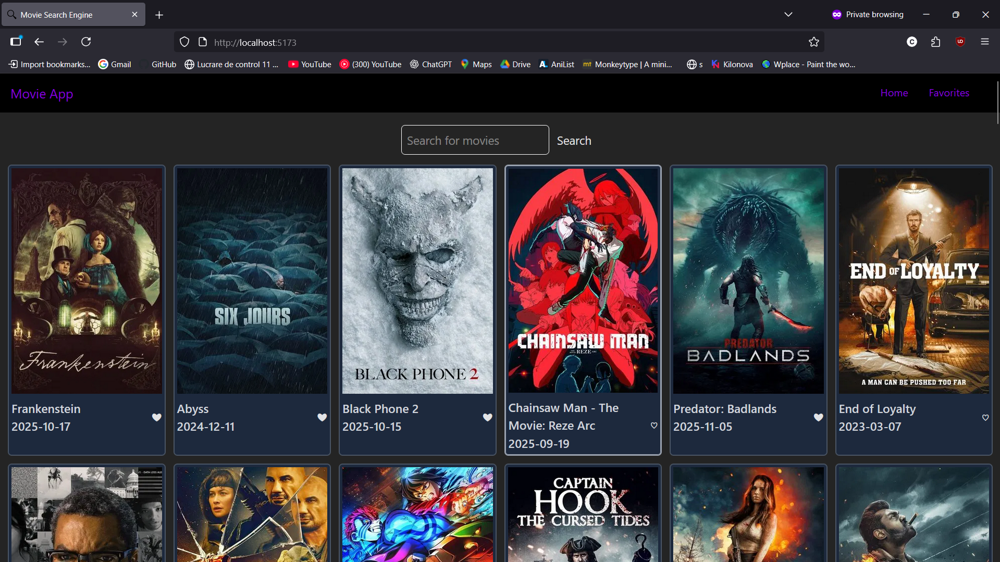
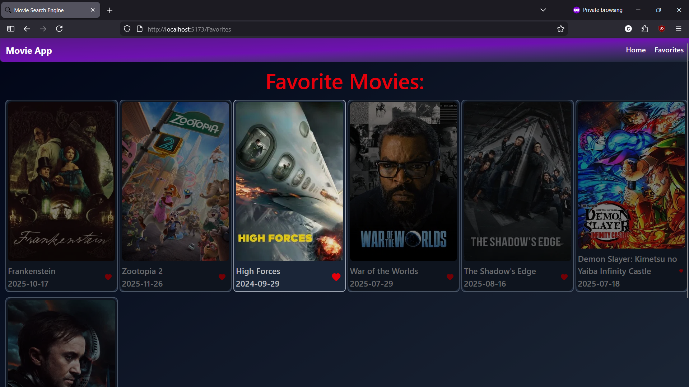

<div align="center">
    <h1 align="center">Movie Search Engine</h1>
    <p align="center">
    A basic <b>Movie Search Engine</b> used to easily search your <b>favorite movies</b>
    <br/>
    <a href="https://github.com/constantyn-silvian/Movie-Search-Engine/issues/new?labels=bug&template=bug_report.md">Report Bug</a>
    &middot;
    <a href="https://github.com/constantyn-silvian/Movie-Search-Engine/issues/new?labels=enhancement&template=feature_report.md">Request Feature</a>
    &middot;
    <a href="https://github.com/constantyn-silvian/Movie-Search-Engine/blob/main/CHANGELOG.md">Changelog</a>
    </p>
</div>

# About The Project
A search engine for finding various types of movies from the TMDb database and adding them to the favorites page.
The home page displays the current most popular movies so you can start planing to watch new films with ease. 

## Demo
#### Home Page

---
#### Favorites Page


## Installing and Setup
### Install dependencies
Node, NPM
```sh
npm install
```
### Setup API key
https://developer.themoviedb.org/docs/getting-started  
Follow the guide from the link above: create an account, log in and get your API key, then put the key in `backend\apiKey.js`.    

### Running

Run frontend
```sh
cd .\frontend\
npm run dev
```

Run backend
```sh
cd .\backend\
node .\index.js
```
## Credits
* TMDB (The Movie Database) — it has a great and easy to read guide that teaches you how to use their API


